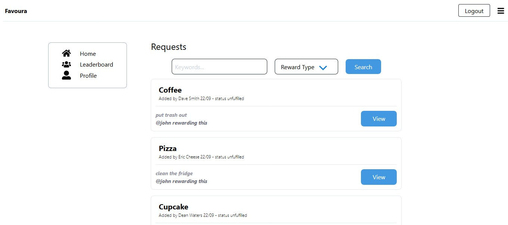

# Favoura | IOU Tracker Server
## Table Of Contents

* [About the Project](#about-the-project)
* [Built With](#built-with)
* [Installation and Usage](#installation-and-usage)
  * [Prerequisites](#prerequisites)
  * [Installation](#installation)
  * [Usage](#usage)
* [Roadmap](#roadmap)
* [License](#license)
* [Acknowledgements](#acknowledgements)

## About The Project



Favoura is a tracking system for “IOU”s or “favours”. An “IOU” is an abbreviation of "I owe you", and it is an informal acknowledgement of a debt or favor owed. This system allows groups or teams to log in and record the favors that they owe to each other. In addition to recording favors, Favoura allows users to post public requests with an offer to provide a favor (the reward), as well as view a leaderboard to see who is fulfilling the most requests.

## Built With

The following technologies were used to build this server:
* Node.JS.
* Express.
* MongoDB / Mongoose.
* AWS Cognito.

## Application Contents

### HTTPReqHandlers Directory
<ul> 
  <li><b>GET-Handlers</b> - A directory containing the GET handlers used in this server.</li>
  <li><b>POST-Handlers</b> - A directory containing the POST handlers used in this server.</li>
</ul>

### Utility Directory
<ul>
  <li><b>RouteHandlers.js</b> - Contains functions for handling each and every individual route trigger. </li>
  <li><b>DB\Connection.js</b> - Provides a connection to our MongoDB Atlas cloud database.</li>
  <li><b>DB\Models</b> - A directory containing the Mongoose models used by the server when interacting with the MongoDB database.</li>
</ul>
  
### App Working Directory
<ul>
  <li><b>Node-Modules</b> - Generated when running 'npm install'. A directory containing the NPM package dependencies used by this server.</li>
  <li><b>server.js</b> - The main server file that utilises Express to start the web server.</li>
  <li><b>package.json</b> - Package.json file used with NPM.</li>
  <li><b>package-lock.json</b> - Package-lock.json file used with NPM.</li>
</ul>

## Installation and Usage

### Prerequisites

* npm

```sh
npm install npm@latest -g
```


### Installation
<ol>
  <li>Clone this repository.</li>
  <li>In the newly cloned repository, open your command line and run the 'npm install' command to download the required packages.</li>
  <li>Run the <b>'npm run server'</b> command to run the server.</li>
  <li>The server is now ready. Try out the following unauthenticated REST requests below.</li>
  <li>To test out the authenticated routes, run the server alongside the Favoura front-end web application and then generate an access token by logging in.</li>
</ol>

### Usage

Here the the HTTP REST routes you may use send to this server to interact with it.

#### HTTP REST Routes (authenticated)

    POST  /newRequest    (Use HTTP body to send the neccessary request data)
    
    POST  /newFavour    (Use HTTP body to send the neccessary favour data)
    
    POST /userData
    

#### HTTP REST Routes (unauthenticated)

    POST  /signup    (Use HTTP body to send the neccessary signup data)
    
    GET  /requests?keywords=keyword
    
    GET /leaderboard
    
## Roadmap

See the [open issues](https://github.com/AryanNateq/AIP-A2-IOU-Tracker-Server/issues) for a list of proposed features (and known issues).

## License

AIP-A2-IOU-Tracker-Server is copyright (c) 2020, Aryan Nateghnia <38933061+aryannateq@users.noreply.github.com>.

## Acknowledgements

* [Sukonrat Kanjanasuttiyakorn](https://github.com/sukonrat)
* [Mohammad Karim](https://github.com/mohammad260)

